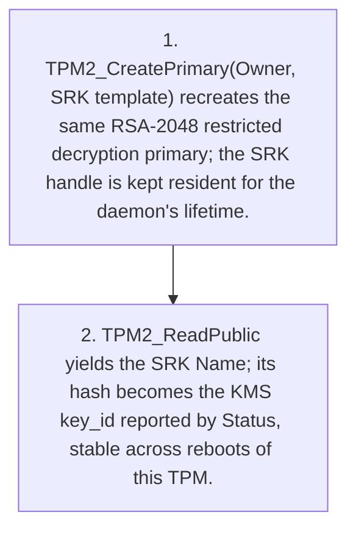
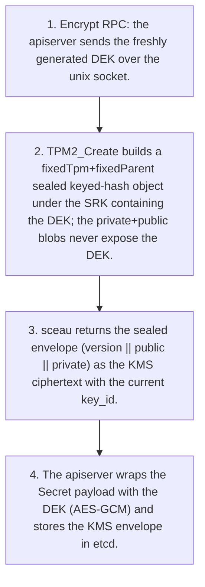
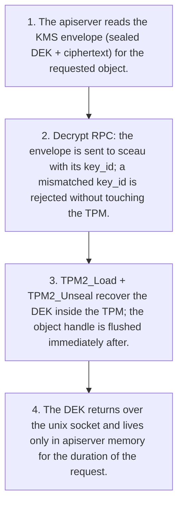

# Architecture Flows

!!! note "Auto-generated"

    Rendered from `docs/architecture/calm/architecture.json` by the CALM
    CLI (`calm template`). **Do not edit this file by hand** — edit the
    architecture JSON or the Handlebars template at
    `docs/architecture/calm/templates/mermaid/flows.md.hbs` and regenerate
    with `make calm-diagrams`.

Each business flow defined in the CALM architecture is rendered below as
its own Mermaid `flowchart TD` — one diagram per flow, linking the
transitions in sequence order. Three flows are modelled today:

- **sceau startup: recreate the SRK** — the deterministic primary key is
  recreated at boot and the stable key_id is derived.
- **Encrypt a Secret write** — the happy path from apiserver DEK to sealed
  envelope in etcd.
- **Decrypt a Secret read** — envelope back to plaintext DEK, in memory
  only.

## sceau startup: recreate the SRK

At boot (before the apiserver starts) sceau connects to the TPM and recreates the deterministic SRK primary from the standard template — identical key material on every boot of the same TPM — then derives the stable key_id from the SRK Name.

Source: flow `flow-startup-srk` in `architecture.json`.

## Encrypt a Secret write

The apiserver generates a DEK for a write, sceau seals it under the SRK, and the envelope is persisted in etcd.

Source: flow `flow-encrypt-secret` in `architecture.json`.

## Decrypt a Secret read

On a read, the apiserver hands the stored envelope back to sceau, which unseals the DEK inside the TPM; plaintext crosses only the host-local socket.

Source: flow `flow-decrypt-secret` in `architecture.json`.

