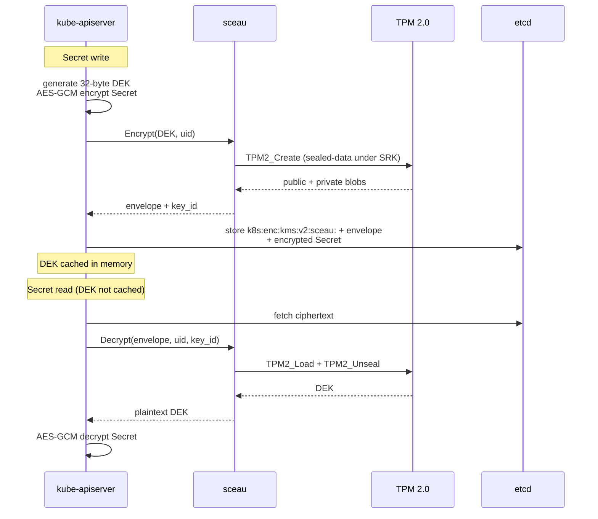

# KMS v2 Protocol

sceau implements the plugin side of the Kubernetes
[KMS v2 API](https://kubernetes.io/docs/tasks/administer-cluster/kms-provider/):
three gRPC methods over a unix socket, defined in
[`proto/kms/v2/api.proto`](https://github.com/firestoned/sceau/blob/main/proto/kms/v2/api.proto).
This page explains the contract and how sceau fulfils it; the wire-level
message reference is on the [API reference](../reference/api.md) page.

## Why v2 and not v1

KMS v2 has been the stable API since Kubernetes 1.29 and fixes the two
structural problems of v1:

- **The plugin, not the apiserver, owns the `key_id`.** In v1 the apiserver
  guessed at key identity; in v2 `Status` and `Encrypt` responses carry the
  authoritative `key_id`, and `Decrypt` receives it back verbatim.
- **Health is explicit.** `Status` returns `healthz` alongside the version and
  current key, so the apiserver can tell "plugin down" from "plugin rotating".

Every `EncryptionConfiguration` example in this documentation uses
`apiVersion: v2` — matching the proto, per the repo's documentation rules.

## The service

```proto
service KeyManagementService {
    rpc Status(StatusRequest) returns (StatusResponse) {}
    rpc Decrypt(DecryptRequest) returns (DecryptResponse) {}
    rpc Encrypt(EncryptRequest) returns (EncryptResponse) {}
}
```

### Status

Called at startup and periodically thereafter. sceau returns:

| Field | Value |
| --- | --- |
| `version` | `"v2"` |
| `healthz` | `"ok"` |
| `key_id` | the current key, e.g. `sceau-9f2c41a7b3e80d1c` |

The apiserver will not use the plugin until `key_id` is non-empty. Because
sceau recreates its SRK before it binds the socket, a process that is
listening is a process that can seal — `healthz` is a constant `"ok"` by
construction.

### Encrypt

Input: a plaintext DEK (32 bytes, generated by the apiserver) and a request
`uid`. sceau seals the DEK under the SRK ([details](tpm-sealing.md)) and
returns:

- `ciphertext` — the TPM envelope: `version(1) || public_len(u16 BE) ||
  public || private`;
- `key_id` — the SRK-derived key identity (always the same value on a given
  TPM);
- `annotations` — empty today; reserved for future metadata.

Errors are returned as gRPC `INTERNAL` with only the error *class* exposed —
TPM internals are deliberately not leaked to the apiserver. A DEK larger than
128 bytes is rejected (a Kubernetes DEK is 32 bytes, so this never fires in
practice).

### Decrypt

Input: the envelope from a previous `Encrypt`, the original `uid`, the
`key_id` the apiserver recorded, and the stored annotations. sceau first
checks the `key_id`:

```
if req.key_id != sealer.key_id() → INVALID_ARGUMENT
    "unknown key_id <X>; this TPM only serves <Y>"
```

Then it loads the sealed object under the SRK, unseals it, flushes the loaded
handle, and returns the plaintext DEK.

## DEK lifecycle



Two lifecycle facts matter operationally:

1. **DEKs are per-write and short-lived in memory.** The apiserver caches a
   DEK after first use and generates new ones over time; old DEKs remain
   readable forever because their envelopes live in etcd and the SRK that
   unseals them is deterministic.
2. **"Key rotation" in the KMS sense does not exist here.** There is exactly
   one key — the SRK — and it never changes on a given TPM. What operators
   rotate instead is the *provider configuration* (e.g. migrating from
   `aescbc` to `kms`, or between KMS plugins); see the
   [k0s setup guide](../guides/k0s-setup.md) for the migration procedure.

## Concurrency and failure modes

The TPM is a single-threaded resource: sceau serializes all TPM commands
through a mutex, so concurrent `Encrypt`/`Decrypt` calls queue rather than
corrupt TPM sessions. Throughput is bounded by the TPM itself (tens of
operations per second) — ample for KMS workloads, which see one seal per
Secret write, and irrelevant for reads once the apiserver's DEK cache is warm.

If sceau is unreachable, the apiserver's KMS health check fails and Secret
reads/writes that miss the DEK cache error out — the failure is loud, not
silent. systemd restarts sceau (`Restart=always`), and because the SRK is
recreated deterministically, a restarted sceau unseals everything its
predecessor sealed.
