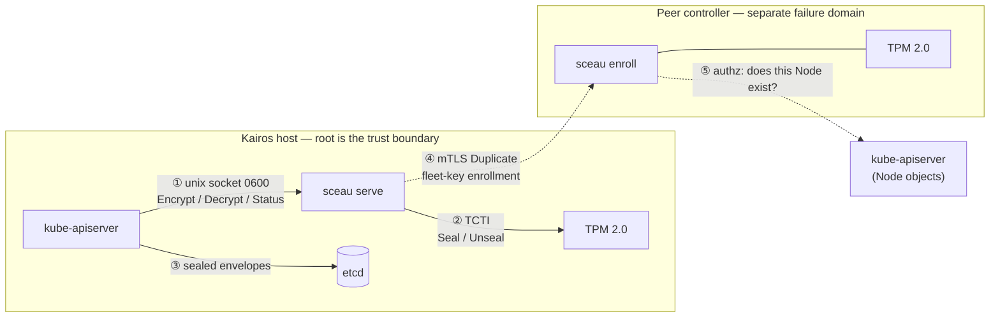

# Threat Model

What sceau protects, what it trusts, and what it deliberately does not defend
against — stated plainly. The posture is a set of recorded trade-offs
([ADR-0001](https://github.com/firestoned/sceau/blob/main/docs/adr/0001-tpm-sealed-kms-v2-plugin.md),
[ADR-0003](https://github.com/firestoned/sceau/blob/main/docs/adr/0003-fleet-key-duplication-for-ha-multi-controller.md));
this page is the operator-facing summary. To report a vulnerability, see
[Security](../reference/security.md).

This document describes **the software**. It is not a threat model of any
particular deployment — your own environment's assumptions, network position
and compensating controls are yours to model.

## Actors

| Actor | Description | Trusted? |
| --- | --- | --- |
| **Cluster operator** | Provisions the host, installs k0s, runs `genesis`/`enroll`/`join`, writes the `EncryptionConfiguration`. | Yes — fully. |
| **kube-apiserver** | Issues `Encrypt`/`Decrypt`/`Status` over the unix socket. Runs as root on the same host. | Yes. |
| **Peer sceau node** | Another controller in the same HA fleet; the `join` client or the `enroll` server. | Only after mTLS **and** Node authorization. |
| **Unprivileged local process** | Any non-root process on the host. | No. |
| **Network attacker** | Can reach the `enroll` listener while it is open. | No. |
| **Physical attacker** | Has the disk, the machine, or both. | No. |

## Assets

| Asset | Where it lives | Exposure if lost |
| --- | --- | --- |
| **Secret plaintext** | apiserver memory only | Full disclosure of cluster secrets |
| **DEKs** | apiserver memory; sealed in etcd | Decryption of the Secrets they wrap |
| **Per-node SRK** | Inside the TPM; never persisted | Node's own sealed data |
| **Fleet sealing key** | Inside each fleet member's TPM, at persistent handle `0x81020001` | **Every DEK in the fleet** |
| **Joiner transport key** | Joiner's TPM, one-shot | The single duplication blob in flight |
| **k0s CA private key** | `<data-dir>/pki/ca.key` on controllers | Ability to mint any cluster identity |

The fleet sealing key is the highest-value asset in the system: it is the one
key whose disclosure compromises every node at once.

## Trust boundaries and data flows



Solid arrows stay within one host; dashed arrows cross the network.

Four boundaries, each crossed by a distinct flow:

1. **Unprivileged → root** (`①`). The KMS socket is mode `0600`; only root
   may connect. Root *is* the boundary, by design.
2. **Software → TPM** (`②`). Everything past the TCTI is enforced by the chip:
   object attributes, auth policies, hierarchy seeds.
3. **Memory → disk** (`③`). Only sealed envelopes reach etcd; no plaintext
   key material is ever persisted.
4. **Node → network** (`④`,`⑤`). Introduced by ADR-0003. This is the only
   network-reachable surface sceau exposes, and it exists **only** while an
   operator is running `sceau enroll`.

## Assumptions

sceau's guarantees hold only if these hold:

- **The TPM is genuine and not interposed.** No attacker sits on the LPC/SPI
  bus. sceau performs no attestation of the chip itself.
- **The kube-apiserver is honest.** It is root on the same host and holds
  every DEK in plaintext by necessity. sceau cannot and does not defend
  against a malicious apiserver.
- **The k0s CA is honest and its key is not already compromised.** Enrollment
  authentication reduces entirely to "holds a certificate this CA signed."
- **The node OS and boot chain are intact.** No PCR policy is enforced today
  (see below), so sceau trusts the running kernel implicitly.
- **The operator's `enroll` window is supervised.** `enroll` is a deliberate,
  bounded, interactive act — not a service left running.
- **etcd is doing its own job.** sceau protects DEKs; it does not protect
  against an attacker who can read Secret plaintext out of a live apiserver.

## In scope

Threats sceau is designed to resist:

| Threat | Defence | Configurable |
| --- | --- | --- |
| **Disk theft / imaging** — attacker clones the etcd data directory. | Envelopes are inert without the originating TPM. Under a per-node SRK, sealed objects are `fixedTpm`+`fixedParent`. | No |
| **Key-file theft** — as with the `aescbc`/`secretbox` providers. | There is no key file. The SRK is recreated in TPM-internal memory at startup and never persisted. | No |
| **Post-mortem forensics** — swap, crash dumps, decommissioned media. | DEKs are transient in apiserver memory; the SRK never leaves the chip. | No |
| **Offline brute force of envelopes** | Private areas are protected by the TPM's seed-derived hierarchy keys. No password, no offline oracle. | No |
| **Unprivileged local process asking sceau to unseal** | KMS socket created mode `0600`. | `--socket` path |
| **Unauthenticated network peer requesting the fleet key** | mTLS, client CA = the cluster's own k0s CA. | `--listen` |
| **Authenticated-but-unauthorized peer** | Two separate authorization checks. The operator must name the joiner with `--allow-node` — cluster membership alone is deliberately not sufficient, since every kubelet in the cluster holds a certificate the same CA signed. The peer's certificate CN must additionally be a `system:node:<name>` identity naming a `Node` object that currently exists. | `--allow-node` (required) |
| **Fleet key wrapped to an attacker-chosen key** | The joiner's transport key must be a restricted RSA-2048 storage key with `fixedTpm`+`fixedParent`, checked before it is used as a duplication target. See the limitation below on what this does not prove. | No |
| **Indefinite enrollment exposure** | `enroll` is one-shot and bounded: the listener closes after `--max` successful duplications or `--timeout-secs`, whichever comes first. Default `--max` is 1. | `--max`, `--timeout-secs` |
| **Cross-key ciphertext confusion** | `Decrypt` rejects a `key_id` that matches neither the active nor the legacy sealer. | No |
| **Tampered release artifacts** | CycloneDX SBOMs, Cosign keyless signatures by digest, SLSA Build L3 provenance, Grype + `cargo-deny`/`cargo-audit` gates, SHA-pinned actions. | No |

## Out of scope

These are explicitly **not** defended against. Reports that presuppose them
will be closed as out of scope:

- **Root on the host.** Root can ask sceau to unseal anything, read the
  apiserver's memory, or drive the TPM directly. The socket is `0600`
  precisely because root is the boundary, not a target.
- **A compromised kube-apiserver.** It legitimately holds every DEK in
  plaintext. sceau does not defend against the component it exists to serve.
- **A compromised k0s CA.** Enrollment authentication is delegated to it
  entirely; a forged node certificate is indistinguishable from a real one.
- **Physical possession of a running machine with its TPM.** See the
  possession-only limitation below.
- **Hardware attacks on the TPM** — bus interposers, glitching, decapping.
- **Denial of service.** sceau is a single-threaded TPM front-end; a root
  caller can trivially saturate it. Availability is not a goal of this design.
- **Anything in a specific deployer's environment.** Network placement,
  who can reach `--listen`, and operational controls around `enroll` are
  properties of a deployment, not of this software.

## Accepted risks and design limitations

These are known, deliberate, and will not be "fixed" without an ADR that
changes the design.

### TPM loss is data loss

!!! failure "Treat the TPM as the root of trust it is"
    A dead TPM, a motherboard replacement, or `tpm2_clear` makes every sealed
    DEK **permanently unrecoverable** — and with it, the plaintext of every
    encrypted Secret in etcd. There is no recovery path, no escrow, no backup
    key. That is what "no key management" means: there is nothing to back up,
    and therefore nothing to restore from.

- **etcd snapshots shipped off-host are mandatory**, and only useful if you
  can restore onto the *same* TPM or rebuild state from GitOps source.
- **Do not clear the TPM** during unrelated maintenance (firmware updates
  sometimes prompt for it) without first migrating to another provider.
- **Motherboard swaps are cluster rebuilds** unless the TPM is a discrete
  module that moves with the board.

Fleet-key mode (ADR-0003) narrows this: the key survives on the *other*
controllers. It does not eliminate it — losing every fleet member at once is
still unrecoverable.

### Possession of the TPM is sufficient — no PCR policy

!!! warning "Disk plus machine, moved together, will unseal"
    Unsealing requires only physical possession of the functioning TPM. No PCR
    policy is checked, so an attacker who steals the whole machine — or moves
    the disk to a machine whose boot path they control while keeping the
    original TPM — will unseal successfully. The seal binds to the chip, not
    to the software state of the boot.

Binding unseal to a PCR policy (PCR 7 secure-boot state, or the Kairos UKI
measurements) is a planned follow-up in ADR-0001 and will go through the
normal ADR → CALM → TDD path.

### Fleet mode trades per-node binding for availability

This is the central trade-off of ADR-0003 and operators should make it
knowingly:

- Under a **per-node SRK**, sealed objects are `fixedTpm`+`fixedParent` — they
  can never leave the chip that made them.
- Under the **fleet key**, they cannot be, because the whole point is that any
  fleet member can unseal them. The fleet key itself is created duplicable,
  with a `PolicyCommandCode(TPM2_Duplicate)` authorization policy.

The practical consequence: **root on any single fleet member can export the
fleet key** and therefore decrypt every Secret in the cluster, on hardware of
their choosing. Root on a non-fleet node cannot. Adding a controller to the
fleet widens this blast radius by one machine — size the fleet for the
availability you need and no larger.

### Transport-key validation constrains the template, not the holder

The seed checks that a joiner's transport key is a restricted RSA-2048 storage
key with `fixedTpm`+`fixedParent` before wrapping the fleet key to it. Be clear
about what that check is worth: those attributes are fields in a structure the
joiner submits, so they constrain the *shape* of the duplication target, not
who holds the corresponding private key.

Proving that a real TPM holds it requires a credential-activation challenge
bound to that key's Name (`TPM2_MakeCredential`), which is
[ADR-0003](https://github.com/firestoned/sceau/blob/main/docs/adr/0003-fleet-key-duplication-for-ha-multi-controller.md)
Phase 6 and is not implemented. Until it is, the operator's `--allow-node`
decision — not the TPM — is what bounds who can receive the fleet key. Name
only nodes you are deliberately enrolling, and keep the `enroll` window short.

### `enroll` is a privileged, deliberately short operation

While `sceau enroll` runs, the process:

- reads the **k0s CA private key** (`<data-dir>/pki/ca.key`) to mint its
  short-lived TLS server leaf, and
- authenticates to the Kubernetes API using k0s's **admin kubeconfig**
  (`<data-dir>/pki/admin.conf`) to check Node membership.

Both are cluster-wide credentials, and for the duration of the command they
are in the address space of a process listening on the network. This is why
`enroll` is one-shot, bounded by `--max`/`--timeout-secs`, and exits rather
than running as a daemon. Run it when you are adding a node, watch it finish,
and do not script it to run unattended.

### The legacy decrypt fallback

After a `join`, a node keeps its pre-join per-node sealer as a **decrypt-only**
fallback so that ciphertext written before the switch remains readable
(ADR-0003 Decision 5). New writes always use the fleet key. The old key
remains usable for decryption until the data is rewritten — plan a re-encrypt
(`kubectl get secrets -A -o json | kubectl replace -f -`) if you want the
older material gone.

## Supply chain

Because sceau touches every DEK the cluster issues, released artifacts carry
the verification set described in
[ADR-0002](https://github.com/firestoned/sceau/blob/main/docs/adr/0002-release-and-supply-chain-pipeline.md)
and
[ADR-0006](https://github.com/firestoned/sceau/blob/main/docs/adr/0006-vex-slsa-and-attestation-parity.md).
Verify before you deploy:

```sh
cosign verify ghcr.io/firestoned/sceau@<digest> \
  --certificate-identity-regexp 'https://github.com/firestoned/sceau/.*' \
  --certificate-oidc-issuer https://token.actions.githubusercontent.com
```

Base images are digest-pinned on a literal `FROM` line so Dependabot re-pins
them, and can be redirected to an internal mirror with `BASE_IMAGE=` for
air-gapped builds without contacting the upstream registry.

## Reporting

Findings that fall inside the in-scope table above are welcome through
[private vulnerability reporting](https://github.com/firestoned/sceau/security/advisories/new).
See [Security](../reference/security.md) for response times.
