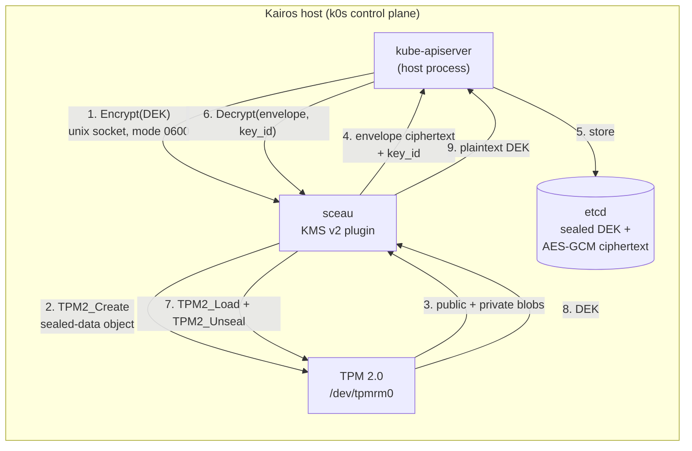

# Overview

> **What sceau does, in one sentence:** it sits between kube-apiserver and the
> host's TPM 2.0, so that every data encryption key Kubernetes issues for etcd
> at-rest encryption is sealed inside hardware — with zero key management.

This page is the **fundamentals**: how Kubernetes envelope encryption, the KMS
v2 protocol, and TPM sealing compose into the system sceau implements. For the
protocol details see [KMS v2 Protocol](concepts/kms-v2.md); for the TPM
object model see [TPM Sealing](concepts/tpm-sealing.md).

## The three layers

| Layer | Role | Who implements it |
| --- | --- | --- |
| **Envelope encryption** | A fresh DEK encrypts each Secret; the DEK is stored next to the data, itself encrypted ("wrapped"). | kube-apiserver |
| **KMS v2 protocol** | The API server delegates DEK wrapping to an external plugin over gRPC on a unix socket. | Kubernetes ↔ sceau |
| **TPM sealing** | Wrapping = creating a sealed-data object under the TPM's Storage Root Key; the sealed blob is the ciphertext. | sceau + TPM 2.0 |

None of these layers stores a long-term key anywhere on disk. The only
long-term secret in the system lives inside the TPM and can never leave it.

## How the pieces fit

Three properties to keep in mind when reading the diagram:

1. **The SRK never leaves the TPM.** It is recreated in memory at sceau
   startup via `TPM2_CreatePrimary` from a deterministic template and flushed
   when sceau exits. Nothing persistent exists outside the chip.
2. **etcd only ever holds ciphertext** — the AES-GCM-encrypted Secret plus the
   TPM-sealed DEK envelope. Steal the disk and you have neither key.
3. **The socket is the trust boundary.** sceau listens on a unix socket with
   mode `0600`; only root (and therefore the API server) can ask it to seal or
   unseal.

## Envelope encryption, concretely

A Kubernetes Secret write with a KMS v2 provider configured looks like this:

1. The API server generates a random 32-byte **DEK**.
2. It encrypts the Secret with the DEK (AES-GCM).
3. It calls `Encrypt(DEK)` on sceau; sceau seals the DEK under the SRK and
   returns the **envelope** — `version || public || private` blobs — plus a
   `key_id`.
4. etcd stores `k8s:enc:kms:v2:sceau:` + envelope alongside the encrypted
   Secret, and the API server caches the DEK in memory keyed by that `key_id`.

Reads reverse the flow: the API server calls `Decrypt(envelope, key_id)`,
sceau loads the sealed object under the SRK, unseals it, and returns the DEK.

## key_id semantics

The `key_id` sceau reports in `Status` and `Encrypt` responses is derived from
the SRK's **Name** — `sceau-<first 16 hex chars of SHA-256(name)>` — and the
Name cryptographically binds the primary's public area. Because the SRK
template is deterministic, the same TPM always recreates the same primary and
therefore the same `key_id`, across reboots and OS reinstalls.

`Decrypt` rejects any ciphertext tagged with a different `key_id`. On a single
TPM this is an identity check; it exists so the API server's key-rotation and
migration bookkeeping (which assumes a KMS may serve several keys over time)
behaves correctly.

See [KMS v2 Protocol](concepts/kms-v2.md) for the DEK lifecycle and
rotation behaviour, and [TPM Sealing](concepts/tpm-sealing.md) for the
envelope byte format.

## What sceau is **not**

- Not a key management system — there are no keys to list, rotate, revoke, or
  back up. That is the design goal, not a missing feature.
- Not a network service — it serves gRPC over a host-local unix socket only;
  there is no TLS, no authentication, no remote API.
- Not a substitute for etcd backups — [TPM loss is data loss](concepts/threat-model.md),
  so shipping etcd snapshots elsewhere remains mandatory operational practice.
- Not a secrets manager for workloads (Vault, SOPS, external-secrets) — it
  protects the cluster's own etcd data, not application secrets workflows.

## Where to go from here

- [KMS v2 Protocol](concepts/kms-v2.md) — Status/Encrypt/Decrypt semantics
  and the DEK lifecycle.
- [TPM Sealing](concepts/tpm-sealing.md) — the SRK template, sealed-object
  attributes, and the envelope format.
- [Threat Model](concepts/threat-model.md) — what this protects against,
  and what it deliberately does not.
- [Guides](guides/index.md) — run it against a swtpm, then wire up k0s.
